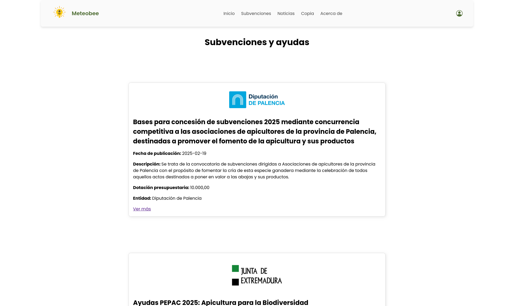

  

 
 

**Project development:**

This project comes to meet a specific need. Beekeepers don’t have a tool that provides them with reliable and personalised information on the weather conditions that may affect their beehives, news from the sector and aid and subsidies they can apply for in order to develop their business. 

This application has been developed in this first iteration taking into account the three reios of Spain where most beekeeping farms are concentrated, which are Castilla y León, Extremadura and Andalucia. If there is enough demand from other regions, its subsequent implementation will be considered. 

The application is based on meteorological data provided by AEMET (Agencia Estatal de Metereología), which depends on the Ministry for Ecological Transition and the Demographic Challenge, an entity of proven solvency. 

Through the use of data capture tools, users are provided with the weather forecast for their municipality for the next seven days, a series of daily recommendations in terms of humidity, rainfall, temperature, etc. On the economic side, it shows the evolution of honey prices and a market forecast. 

The site has a section with news from the sector that will be updated by the owners and a list of aid and subsidies from local, regional and national administrations that can be accessed by beekeepers, which can also be updated.
Users will have general access to the meteorological data and will have the possibility of registering to personalise the experience so that the data is displayed for the municipality they provide. 

The colours, design and functionalities have been approved by the client in repeated meetings with the development team. 
 
 
**The structure of the website:**
- A general access home page where all relevant data is displayed.
  
 
 
- Through the top navigation menu you can access the news and grants and subsidies sections, which will be closed to unregistered users.
  

  
  
  

- To the right of this bar there is a user login icon which allows users who are already registered to enter their username and password or new users to do so. This will give access to personalised data.
 
 

**This project is an exercise carried out in the PeñascalF5 Full-Stack Bootcamp.**
 
The members of the group are:
- Product owner: [Youssef Oulmakhzoune](https://github.com/SideWalk29)
- Scrum master: [Tais Intxaurtieta](https://github.com/intxaurtietadev)
- Programmer: [Azalfa Murtaza](https://github.com/zille5)
- Programmer: [Igor Aranguren](https://github.com/igoribon)
- Programmer: [Nerea Sainz de Aja](https://github.com/nereasaga)
 
 

**The following technologies have been used for its realisation:**

  
  
  
  
  
  
  

 
 

**For the group work, the following methodologies have been used:**

    
  
  
  
  

 
 

**The project has the following parameters:**
- The development of an e-commerce website was requested using everything learned so far within the Bootcamp.
- Use of one or more public APIs, which allow its use. Checking the availability of their use (with registration, api key, token authentication, etc.).
- Use the Vue frontend framework.
- Manage data access through a Json server that simulates the use of a backend.
- As this is a group project, GIT and GITHUB should be used for the development with different branches that will be used for the development.
- On the soft skills side SCRUM and AGILE techniques should be implemented.
- A JIRA dashboard will be created to track tasks and a FIGMA presentation for the preliminary design of the website.
- Use naming techniques in code such as BEM.
- The naming of variables, constants, functions, parameters, etc. will be in English.
- The code will be formatted, commented in English and properly tabulated.
- The project will be fully responsive with at least two breakpoints (design for mobile, tablet and desktop).
 
 

**Project deliverables:**
- Source code, in the form of a Git repository available on GitHub.
- Complete sketch of the prototyping done in Figma (pdf format or images mounted in images mounted in pdf).
- Link to the collaboration tool used (Jira).
